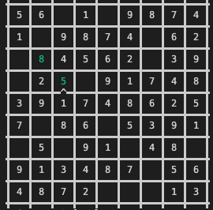

# Sudoku
A cross-platform Sudoku game implemented with C++.



## Dependency
cmake 3.12+ 

Apply to MacOS/Linux/Windows

## Build
On MacOS/Linux ``` sh build.sh ```

## Run
The sudoku.exe is in bin folder.
```
./sudoku    # execute
./sudoku -l filename    # read game progress file
./sudoku -h     # get help
```
## Instruction
0 - erase filled number
u - revoke previous operation
enter - confirm number filled completely
esc - quit game

### Normal Mode
w - cursor upward

a - cursor leftward

s - cursor downward

d - cursor rightward
### VIM Mode
k - cursor upward

h - cursor leftward

j - cursor downward

l - cursor rightward

## File Structure
```
├── CMakeLists.txt      //cmake file
├── README.md
├── build.sh            //build script
├── screenshot.png      //game screenshot
└── src                 //source files
    ├── block.cpp       //sudoku grids class, represent rows, columns
    ├── block.h         
    ├── color.h         //class color
    ├── command.cpp     //class command
    ├── command.h       
    ├── common.h        //common header files
    ├── input.cpp       //class input
    ├── input.h
    ├── main.cpp        //entrypoint
    ├── scene.cpp       //class game scene
    ├── scene.h
    ├── test.cpp        //test file
    ├── test.h
    └── utility.inl     //useful global functions
```